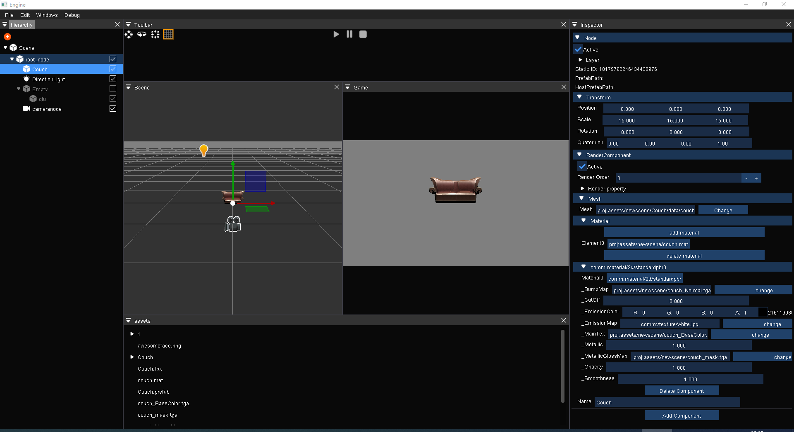

# JYEngine2
3d引擎

## Requirements
1. Windows (个人精力，目前只在win下开发，代码基本都是跨平台的，理论上移植到其他平台也比较容易)
2. VS2019 (只测试过VS2019)
3. CMake

### Build project
  1. 执行CMake指令
  2. VS选择”Editor_Debug“ ”X64“ 启动编辑器编译模式
  3. VS选中”Executable“目录下的”Editor“设为启动项目
  
## Features
  1. 智能指针，RTTI，对象系统，属性反射，基于属性反射的序列化存储
  2. 合理模块划分。引擎分为多个子系统，比如：FileSystem TimeSystem ConfigSystem LogSystem。这些系统都抽象出一个基类单例，然后子系统分别再去实现并初始化，这样可以方便的替换子系统实现不影响引擎主体，并且解决子系统与引擎相互依赖的问题。
  3. 尽可能用更多的第三方工具。比起bgfx(跨平台渲染库) imgui(简单易用的gui) draco(模型压缩) glfw(跨平台窗口库) rapidjson(json解析)。
  4. 跨平台shader语言。 采用unreal离线编译shader库(hlslcc)实现统一的shader语法，离线编译为各个平台。
  5. 材质系统。 类似unity shaderlab语法，支持定义属性、渲染队列、sub shader。
  6. RHI。 抽象出RHI接口，用bgfx adapt去实现。目前支持dx11和opengl渲染。
  4. ECS。 Scene包含一个root gameobject，GameObject包含一组Component，目前实现了LightComponent CameraComponent TransformComponent RenderComponent
  7. 编辑器。 界面操作参考unity编辑器，采用命令系统处理用户操作。scene game分别创建一个场景，每一个用户操作都会分解成[1-N]个命令，命令系统会执行对应命令分别在两个场景执行命令，支持undo redo
  
## Screenshots
PBR
